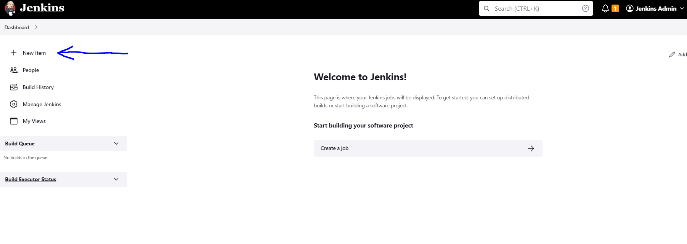
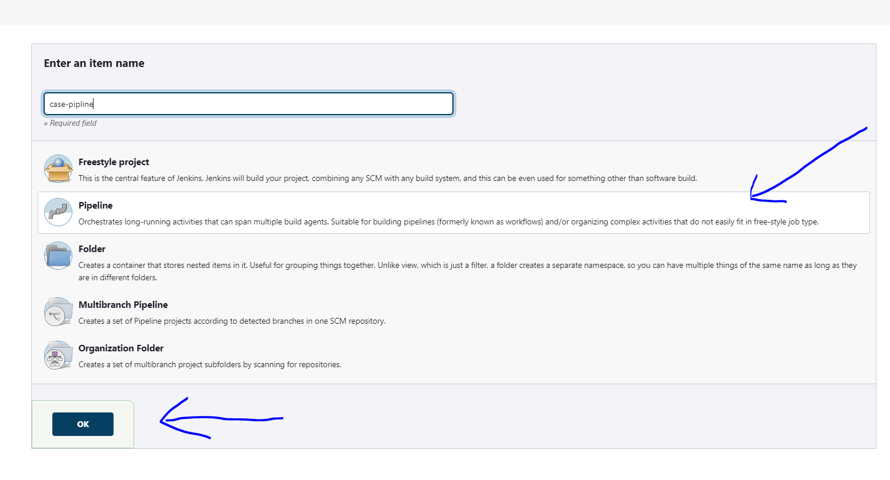
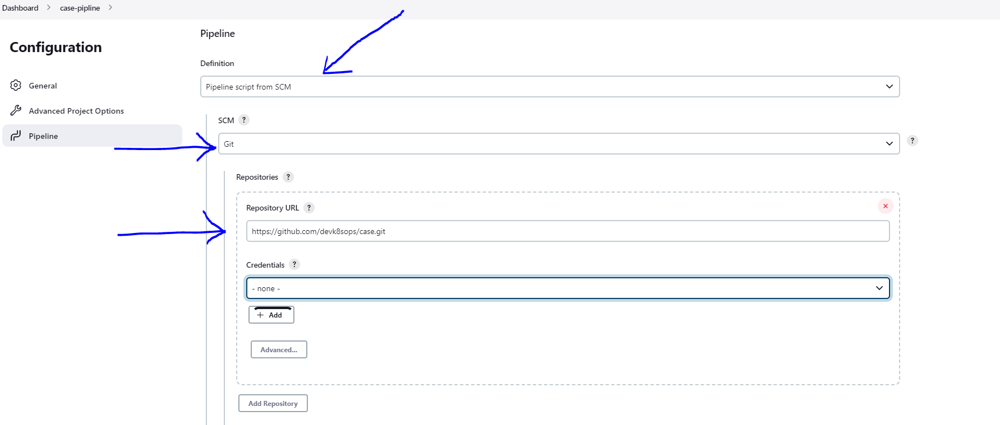
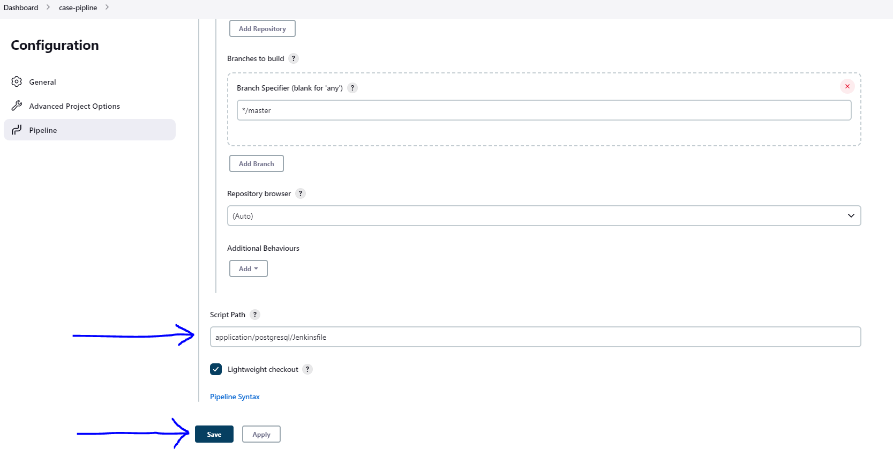
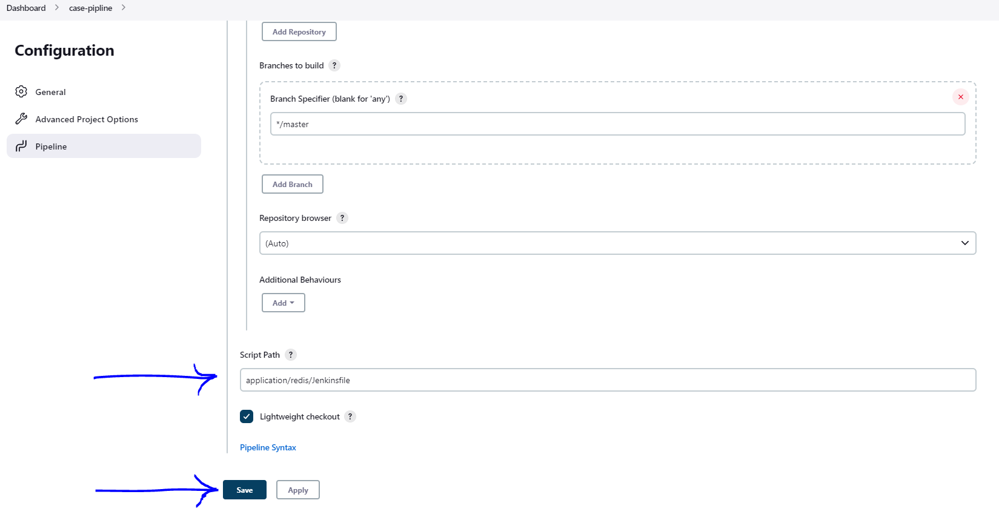
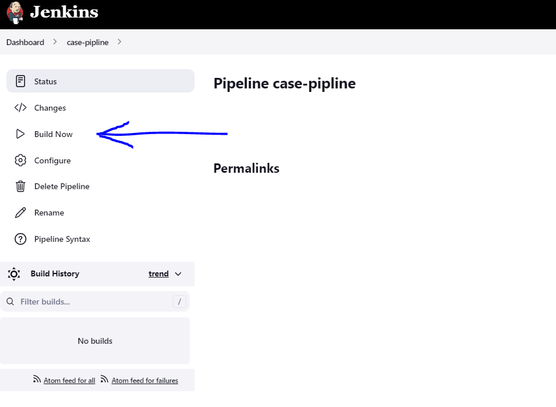

 # Postgresql-Helm and Redis-Helm Deploy with Jenkins


### You can easily start pipeline for postgres and redis by following the screenshots. Ready to go after specifying github repo address and Jenkinsfile location.


### `Jenkins-url:` jenkins.your-host-ip.nip.io   
### `Username:` admin   
### `Password:` admin






```
https://github.com/devk8sops/case.git

```




## Jenkins File Location For Postgresql Pipeline
```
application/postgresql/Jenkinsfile

```




## Jenkins File Location For Redis Pipeline
```
application/redis/Jenkinsfile

```







