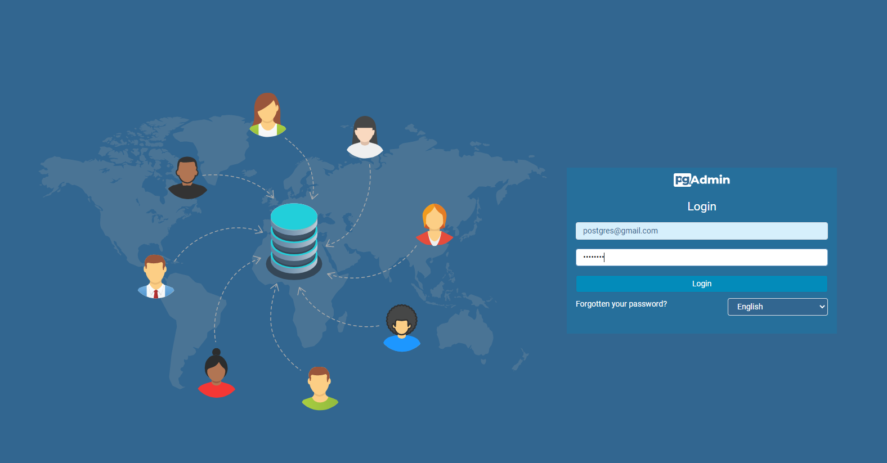
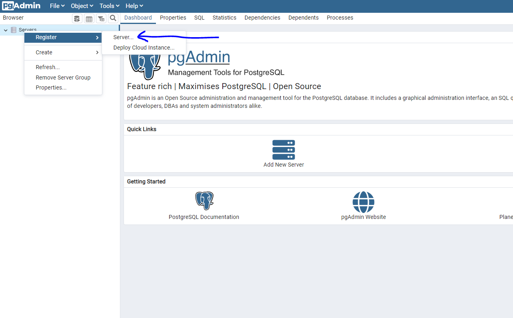
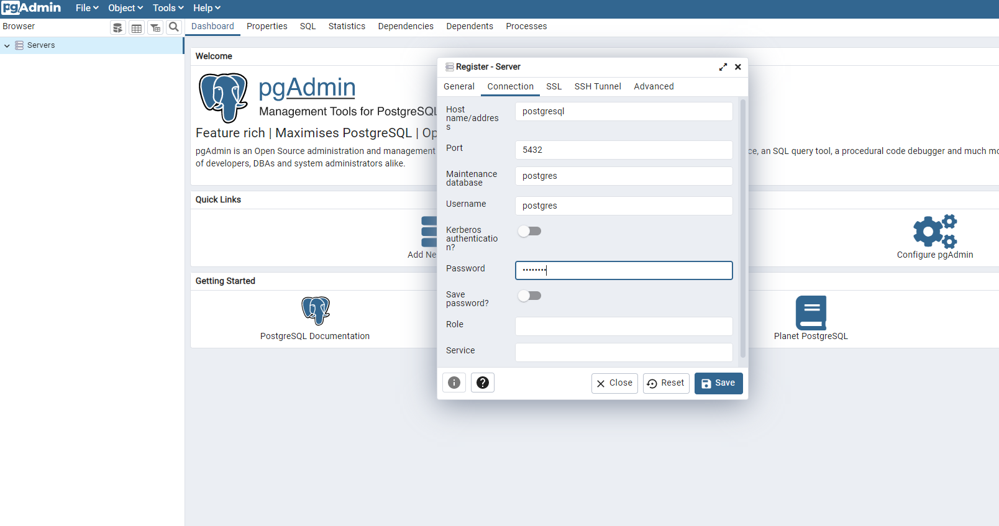
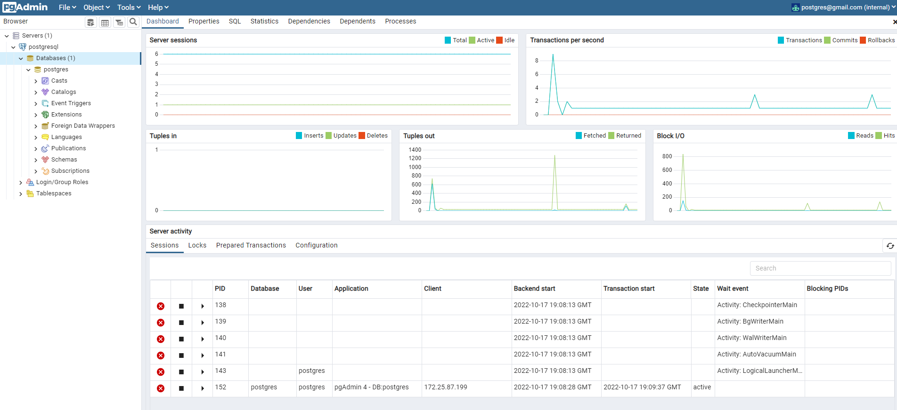

# Health Check Script

### After the postgresql installation, you can run the health-check script on your host machine.

## Postgresql health-check [script](https://github.com/devk8sops/case/blob/master/infrastructure/check-scripts/postgresql-check.sh);

```
./check-scripts/postgresql-check.sh
```

# Postgresql Backup Implementation

### You can take backup of postgresql database via cronjob.

### Create [cronjob](https://github.com/devk8sops/case/blob/master/infrastructure/kubernetes/postgres-backup/postgres-backup-cron.yaml) on your host machine after installation of postgresql database;

```
kubectl apply -f kubernetes/postgres-backup/postgres-backup-cron.yaml
```
## Backup Directory;
```
/mnt/nfs_share/postgres-postgres-backup-task-pvc*
```

# Postgresql and Pgadmin

### `Postgresql user:` postgres 
### `Postgresql password:` postgres

### `Pgadmin url:` pgadmin.your-host-ip.nip.io 
### `Pgadmin user:` postgres@gmail.com 
### `Pgadmin password:` postgres
### `Postgresql service DNS name:` postgresql
### `Postgresql service Port:` 5432

### You can access postgresql from outside of the cluster via pgadmin.








