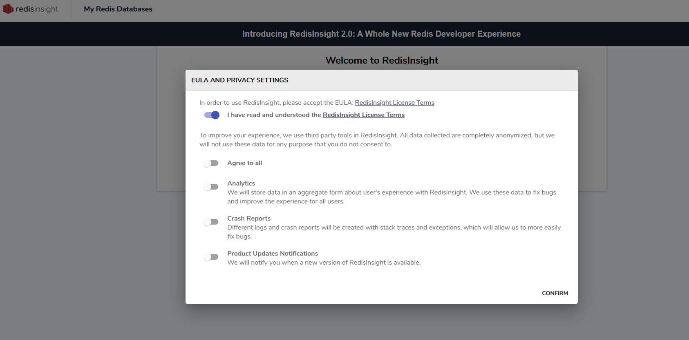
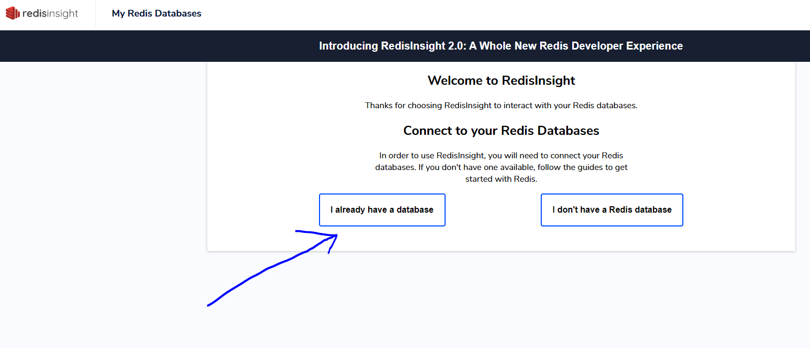
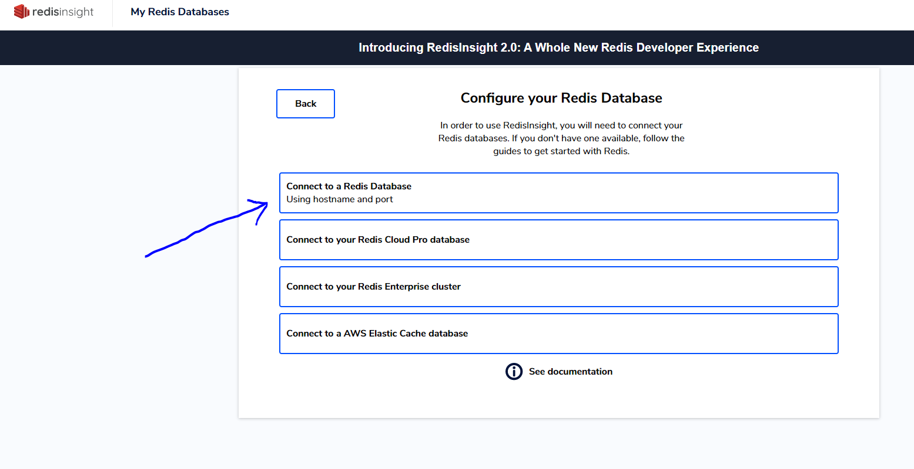
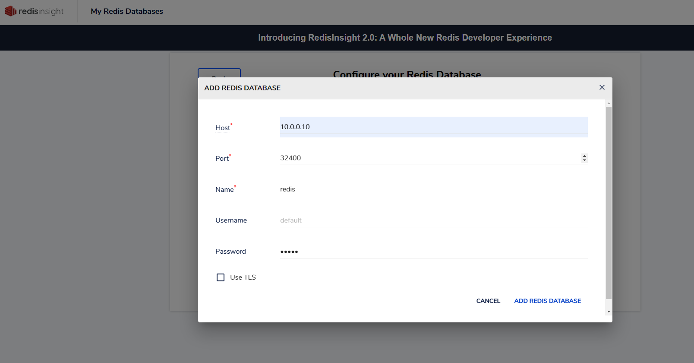
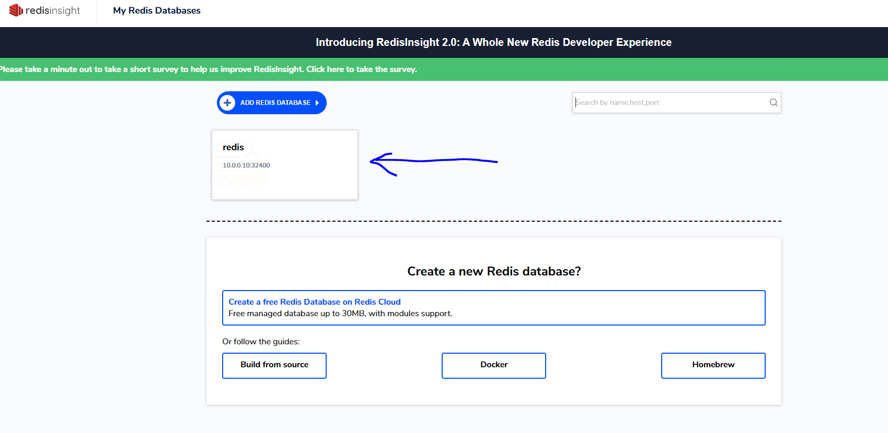
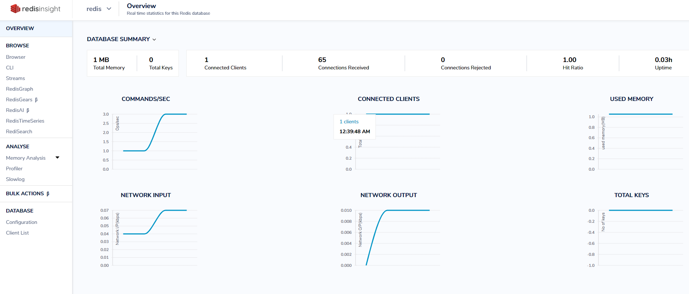

# Health Check Script

### After the redis installation, you can run the health-check script on your host machine.

## Redis health-check [script](https://github.com/devk8sops/case/blob/master/infrastructure/check-scripts/redis-check.sh);

```
./check-scripts/redis-check.sh
```


# Redis and Redis-insight

### `Redis-connection-url:` 10.0.0.10:32400 

### `Redis-password:` redis

### `Redis-insight-url:` your-host-ip:8001

### You can access redis from outside of the cluster via redisinsight.












